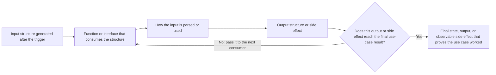

# Writing Plans

## Overview

The key point is to ensure that the final implementation does not drift away from the spec, that it stays aligned with the intended use cases.

The plan should be organized around use-case-level integration tests first. Interface/function contracts exist to support the integration test, not to encourage isolated implementation of internal helpers.

Assume they are a skilled developer, but know almost nothing about our toolset or problem domain. Assume they don't know good design very well.

**Announce at start:** "I'm using the writing-plans skill to create the implementation plan."

**Context:** If working in an isolated worktree, it should have been created via the `medium-powers:using-git-worktrees` skill at execution time.

**Save plans to:** `docs/medium-powers/plans/YYYY-MM-DD-<feature-name>.md`

- (User preferences for plan location override this default)

## Scope Check

If the spec covers multiple independent subsystems, it should have been broken into sub-project specs during brainstorming. If it wasn't, suggest breaking this into separate plans — one per subsystem. Each plan should produce working, testable software on its own.

## Workflow

Before defining tasks, first map out which folders will be modified and what each folder is responsible for. Read the documents below.

Before writing the plan, perform an existing-flow inventory:

- What existing entry points, services, stores, repositories, runtimes, adapters, or test harnesses already exist?
- Which existing flow should this feature reuse or extend?
- Which interfaces or functions need to be implemented, extended, or reused?

Before creating a new flow, inspect the existing codebase and identify the closest reusable flow. The plan must explain whether the new use case reuses, extends, or intentionally bypasses that flow. Bypassing an existing flow requires explicit justification.

For each use case, define one primary integration test group before defining implementation tasks.

The integration test should:

- Start from the real or closest available use-case entry point
- Use real core modules and existing reusable flow whenever possible
- Verify final state, output, and important side effects
- Define which interfaces/functions must be implement or extended for the flow to run
- Prefer positive behavior tests that prove supported behavior works.
- Do not require negative tests whose main assertion is that old behavior, a removed feature, or an unsupported path no longer works. If the plan context points to that kind of test, mark it as intentionally skipped and keep only the relevant plan description.

# File Structure

````markdown
# [Feature Name] Implementation Plan

## [Use case] use case's title

### Goal
Describe in natural language what exactly needs to be implemented.

### Existing Flow Inventory
existing flow should this feature reuse or extend

### Core structure
You need to clarify detail definition of types/interfaces/functions need to be implemented:

- Core domain models
- DTOs / state shapes
- Interface inputs and outputs
- State transitions
-
such as
```
type ThreadState = {
  threadId: string;
  title: string | null;
  status: RunStatus;
  messages: ThreadMessage[];
};

async createThread(params: {id: string...}): Promise<ThreadStoreResult<void>>;
```
Do not rush into implementation. First, make the interfaces clearly express how the flow is connected. Must clearly provide a detailed definition of the capability will be implemented

### Use case map
For each key point, describe the use-case flow with this loop:



For each loop iteration, make clear the consumed structure, the consumer function or interface, the result  structure that consumer output, how the result is consumed next, and which function-level or interface-level capability must be implemented, extend or reused.


- Integration test need to create when exceeding: `/path/to/test.xxx`
natural-language/near-code description(how to make the test work)
During planning, the test may be expressed as near-code to define semantics.
During implementation, the first execution task must turn it into a runnable test or runnable verification before writing production code.
If this would become a negative test, write `Skipped negative test:` and briefly reference only the plan detail that explains why.
> **For agentic workers:** REQUIRED SUB-SKILL: Use medium-powers:subagent-driven-development (recommended)  to make the test work
````

At last ask the user to review the integration test before implementation begins.

## Self-Review

After writing the complete plan, review the plan with fresh eyes and check the plan against it. This is a checklist you run yourself — not a subagent dispatch.

1. Do not reinvent the wheel. If the current task can fit into an existing flow or interface, do not create a separate new flow to handle it.
2. Do not include any functionality that is outside the spec. If such functionality is necessary, explicitly tell the user.
3. In an existing codebase, follow the established patterns. If the codebase uses large files, do not unilaterally restructure it. However, if a file you are modifying has already become unwieldy, it is reasonable to include a split in the plan.

## Execution Handoff

After saving the plan, offer execution choice:

**"Plan complete and saved to `docs/medium-powers/plans/<filename>.md`. Two execution options:**

**1. Subagent-Driven (recommended)** - I dispatch a fresh subagent per task, review between tasks, fast iteration

**2. Inline Execution** - Execute tasks in this session using executing-plans, batch execution with checkpoints

**Which approach?"**

**If Subagent-Driven chosen:**

- **REQUIRED SUB-SKILL:** Use medium-powers:subagent-driven-development
- Fresh subagent per task + two-stage review

**If Inline Execution chosen:**

- **REQUIRED SUB-SKILL:** Use medium-powers:executing-plans
- Batch execution with checkpoints for review
